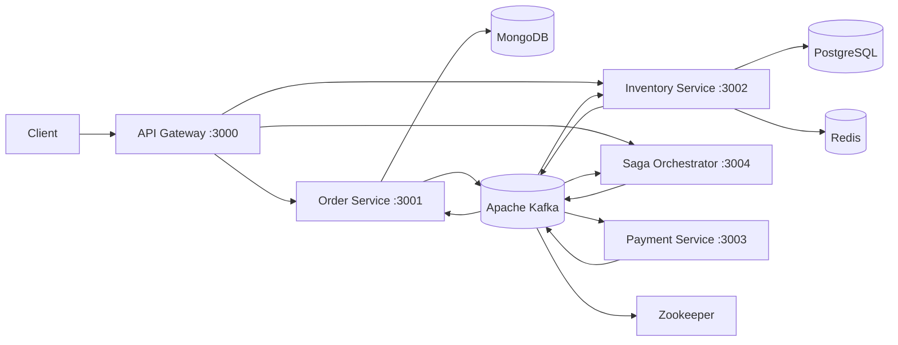

# Architecture Walkthrough

This project is a distributed order-management system built around **microservices, Kafka events, and the Saga pattern**.

## 1. High-Level Architecture



The system has five application services:

| Service | Responsibility | Storage |
|---|---|---|
| API Gateway | Public entry point, authentication, routing, rate limiting | Redis |
| Order Service | Creates and manages orders | MongoDB |
| Inventory Service | Checks and reserves stock | PostgreSQL + Redis |
| Payment Service | Simulates payment processing | None |
| Saga Orchestrator | Coordinates distributed order workflow | In-memory store |

The infrastructure is defined in `docker-compose.yml`.

---

# 2. Repository Structure

## Root Files

### `README.md`

Explains:

- The project architecture
- Required technologies
- Docker startup commands
- Kafka diagnostics
- PostgreSQL diagnostics
- Container log commands

### `docker-compose.yml`

Defines every container:

- Zookeeper
- Kafka
- PostgreSQL
- MongoDB
- Redis
- API Gateway
- Order Service
- Inventory Service
- Payment Service
- Saga Orchestrator

Docker Compose creates one internal network:

```text
stocksync-network
```

Services communicate using Docker service names such as:

```text
http://order-service:3001
http://inventory-service:3002
kafka:29092
redis://redis:6379
```

### `init-postgres.sql`

Creates:

- `products`
- `inventory_reservations`

It also inserts sample products such as:

```text
PROD-001 - Wireless Mouse
PROD-002 - Mechanical Keyboard
PROD-003 - USB-C Hub
```

### `create-topics.sh`

Creates Kafka topics used for communication:

```text
order.created
inventory.reserved
inventory.reservation-failed
payment.processed
payment.failed
saga.order-completed
saga.order-cancelled
```

---

# 3. Main Architectural Decisions

## Decision 1: Separate Services by Business Capability

Each service owns one business responsibility:

- Orders are handled by Order Service.
- Stock is handled by Inventory Service.
- Payments are handled by Payment Service.
- Workflow coordination is handled by Saga Orchestrator.

This avoids putting all business logic into one large application.

The benefit is independent scaling and deployment. For example, inventory processing can scale separately from payment processing.

The cost is operational complexity:

- More containers
- Network communication
- Event delivery failures
- Distributed debugging
- Eventual consistency

---

## Decision 2: Database per Service

The project uses different storage technologies for different domains.

### Order Service

Uses MongoDB because orders are document-oriented and can be stored as flexible records.

```text
MongoDB
    orders collection
```

### Inventory Service

Uses PostgreSQL because stock updates require:

- Transactions
- Row locking
- Numeric consistency
- Foreign keys

Inventory reservations use SQL transactions and:

```sql
SELECT ... FOR UPDATE
```

This prevents two orders from reserving the same stock simultaneously.

### Saga Orchestrator

Currently uses an in-memory JavaScript `Map`.

This is simple for demonstration, but it means saga state disappears whenever the orchestrator restarts.

---

## Decision 3: Kafka for Asynchronous Communication

Services do not directly call one another for the main order workflow.

Instead, they publish Kafka events.

For example:

```text
Order Service
    -> order.created
    -> Inventory Service
```

Then:

```text
Inventory Service
    -> inventory.reserved
    -> Payment Service
```

Kafka provides:

- Loose coupling
- Asynchronous processing
- Event history
- Independent consumers
- Partitioned message delivery

The services use Kafka’s internal Docker listener:

```text
kafka:29092
```

The host machine uses:

```text
localhost:9092
```

That is why Kafka has two listeners in Docker Compose.

---

## Decision 4: Saga Pattern for Distributed Transactions

There is no single transaction spanning:

- MongoDB
- PostgreSQL
- Kafka
- Payment processing

Instead, the project uses a Saga.

The workflow is split into steps:

```text
Create Order
    -> Reserve Inventory
    -> Process Payment
    -> Confirm Order
```

If a later step fails, the system performs a compensating action.

For payment failure:

```text
Payment Failed
    -> Release Inventory
    -> Cancel Order
```

The system does not roll back one global database transaction. It performs business-level compensation.

---

## Decision 5: API Gateway as the Public Boundary

Clients should communicate with the API Gateway instead of directly calling internal services.

The gateway provides:

- JWT authentication
- Rate limiting
- CORS
- Request routing
- Health aggregation
- One public API entry point

Internal services remain addressable inside Docker, but external clients use:

```text
http://localhost:3000
```

---

# 4. Two Communication Styles Are Used

This project uses both **synchronous HTTP** and **asynchronous Kafka**.

## Synchronous HTTP

Used when a client needs an immediate response:

```text
Client -> API Gateway -> Order Service
```

Also used for compensation:

```text
Saga Orchestrator -> Inventory Service /inventory/release
```

## Asynchronous Kafka

Used for long-running workflow transitions:

```text
Order Service -> order.created
Inventory Service -> inventory.reserved
Payment Service -> payment.processed
Saga Orchestrator -> saga.order-completed
```

This combination is deliberate:

- HTTP is useful for immediate request/response operations.
- Kafka is useful for distributed workflow events.
- Compensation currently uses HTTP because the orchestrator needs to know whether inventory release succeeded.

---

# 5. Current Architectural Style

The project is best described as:

> A Dockerized microservice system using event-driven communication, database-per-service ownership, and a hybrid Saga implementation.

It is not purely choreography because the Saga Orchestrator actively coordinates state and compensation.

It is also not purely orchestration because Inventory and Payment services react independently to Kafka events.

So the current design is a **hybrid event-driven Saga architecture**.

---

# 6. Important Current Limitations

These are architectural limitations rather than syntax issues:

1. Saga state is stored only in memory.
2. Kafka consumers generally log errors instead of using retries or dead-letter topics.
3. Inventory reservation needs stronger idempotency protection.
4. Payment processing is randomized and intentionally mocked.
5. Authentication currently appears to be demo-level rather than production-grade.
6. The README mentions a Dashboard, but no Dashboard service exists in the current repository.
7. Kafka and service health checks do not always prove that the complete workflow is ready.

The next step should trace one complete order from `POST /orders` through Kafka, inventory, payment, compensation, and final order state.
