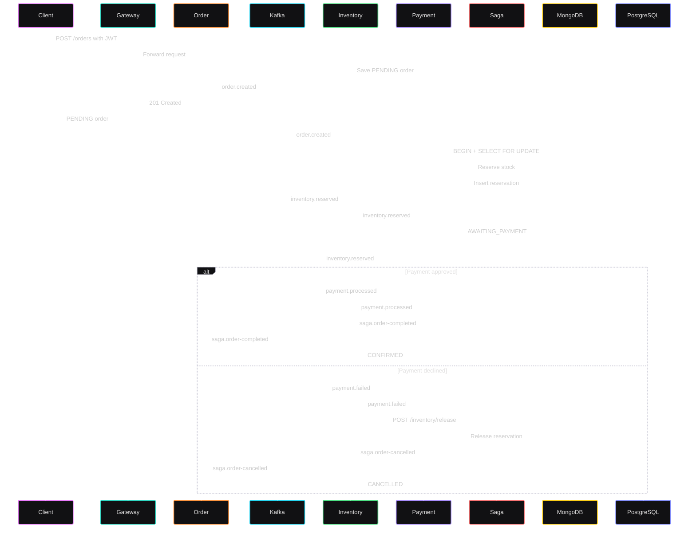

# StockSync — Distributed Inventory-Order Platform

A microservices-based inventory and order management system demonstrating event-driven architecture, the Saga pattern, and distributed transactions.

## Architecture

- **API Gateway** — Express.js, JWT auth, rate limiting (Redis)
- **Order Service** — Node.js + MongoDB
- **Inventory Service** — Node.js + PostgreSQL
- **Payment Service** — Mock payment processor
- **Saga Orchestrator** — Distributed transaction coordinator
- **Dashboard** — Next.js frontend




## Quick Start

```bash
# ==========================================
# 1. INFRASTRUCTURE & SERVICES SETUP
# ==========================================

# Start all Docker containers in detached mode
docker-compose up -d

# Create the required Kafka topics
./scripts/create-topics.sh


# ==========================================
# 2. SYSTEM DIAGNOSTICS & CHECKS (Optional)
# ==========================================

# Check PostgreSQL database tables
docker exec -it stocksync-postgres psql -U stocksync -d inventory -c "\dt"

# Test Kafka connection from YOUR local machine (External Listener)
docker exec stocksync-kafka kafka-broker-api-versions --bootstrap-server localhost:9092

# Test Kafka connection from INSIDE Docker (Internal Listener)
docker exec stocksync-kafka kafka-broker-api-versions --bootstrap-server kafka:29092


# ==========================================
# 3. LOG MONITORING
# ==========================================

# Stream live container logs. Replace <SERVICE_NAME> with one of the following:
# - stocksync-order-service
# - stocksync-inventory-service
# - stocksync-payment-service
# - stocksync-saga-orchestrator
# - stocksync-api-gateway
docker logs -f <SERVICE_NAME>

```

## Tech Stack

- Node.js, TypeScript, Express
- PostgreSQL, MongoDB, Redis
- Apache Kafka
- Docker, Docker Compose
- Next.js, React, Tailwind CSS
- Jest, Supertest

## Author

Pruthwiraj Nayak — Building this to demonstrate distributed systems expertise.
