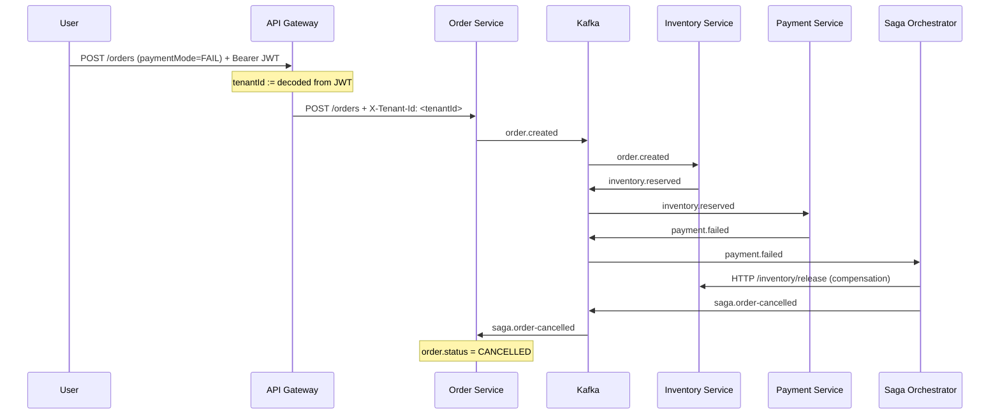
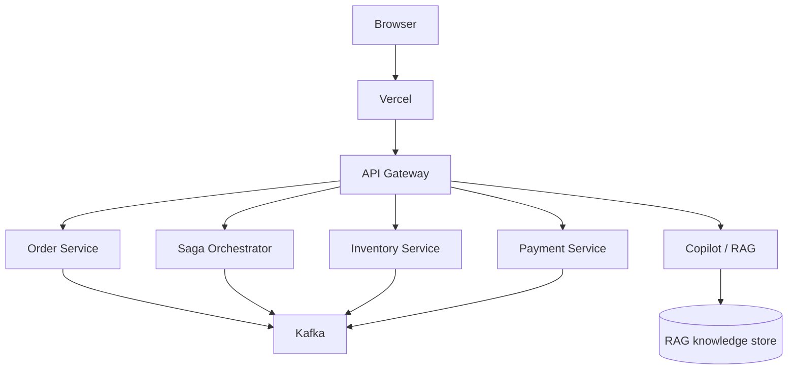

# StockSync — Tenant-Scoped Order Operations Copilot

A microservices order-management platform demonstrating tenant isolation for
users, orders, sagas, and operational knowledge, plus a hybrid RAG Copilot
grounded in live transactional facts and tenant-scoped operational knowledge.

**Live demo:** https://stocksync-nine.vercel.app

## Try it

| Tenant | Admin | User |
|---|---|---|
| Acme | `admin@acme.stocksync` | `user@acme.stocksync` |
| Beta | `admin@beta.stocksync` | `user@beta.stocksync` |

The login page provides one-click access to both seeded demo tenants. No registration is required.

### 60-second walkthrough

1. Log in as `user@acme.stocksync`
2. In the **Demo Order** panel, choose a product, keep **Successful payment**,
   and click **Create Demo Order**
3. You land on the order detail page. The saga runs asynchronously — click
   **Refresh** after a few seconds to see the status transition to
   `CONFIRMED` / `COMPLETED`
4. Click **Ask Copilot about this order** → ask "Why was this order
   completed?" → the Copilot answers using live order facts, live saga facts,
   and retrieved operational knowledge, with sources listed
5. Log out, log in as `user@beta.stocksync`, and navigate to the same order
   URL → **"Order not found"**

That last step is the tenant-isolation check. Same URL, different tenant,
different result.

## What makes this interesting

**Hybrid RAG, not pure vector search.** Structured order and saga state lives
behind transactional APIs — the Copilot doesn't try to embed it and search for
it. Instead it combines:

- **Exact live facts** fetched from the Order and Saga services at request time
- **Semantic retrieval** over a small tenant-scoped corpus of operational docs
  (SLAs, runbooks, order lifecycle)
- **LLM generation** grounded in both, with explicit delimiters separating
  retrieved data from prompt instructions

**Multi-tenant from the JWT up.** The gateway derives tenant identity from the
verified JWT, overwrites any client-supplied `X-Tenant-Id`, and every
downstream query filters by tenant. Cross-tenant lookups return `404` —
indistinguishable from "doesn't exist," so the API doesn't leak resource
existence. RAG retrieval filters by tenant before semantic ranking, so one
tenant's private docs never reach another tenant's LLM context. The shared
product catalog is intentionally tenant-agnostic.

**Distributed transactions via Kafka.** Orders flow through a saga: inventory
reservation, payment, and compensation on failure. Saga state is persisted in
MongoDB, survives restarts, and is what the Copilot reads when answering "why
did this order fail?"

## How an order flows

The failure path is the more interesting one — payment fails, the saga
compensates, inventory is released:


```mermaid
sequenceDiagram
    participant U as User
    participant G as API Gateway
    participant O as Order Service
    participant K as Kafka
    participant I as Inventory Service
    participant P as Payment Service
    participant S as Saga Orchestrator

    U->>G: POST /orders (paymentMode=FAIL) + Bearer JWT
    Note over G: tenantId := decoded from JWT
    G->>O: POST /orders + X-Tenant-Id: <tenantId>
    O->>K: order.created
    K->>I: order.created
    I->>K: inventory.reserved
    K->>P: inventory.reserved
    P->>K: payment.failed
    K->>S: payment.failed
    S->>I: HTTP /inventory/release (compensation)
    S->>K: saga.order-cancelled
    K->>O: saga.order-cancelled
    Note over O: order.status = CANCELLED
```

The success path replaces `payment.failed` with `payment.processed`, no
compensation runs, and the order ends `CONFIRMED / COMPLETED`.

## Architecture


```mermaid
flowchart TD
    Browser --> Vercel
    Vercel --> Gateway[API Gateway]
    Gateway --> Order[Order Service]
    Gateway --> Inventory[Inventory Service]
    Gateway --> Payment[Payment Service]
    Gateway --> Saga[Saga Orchestrator]
    Gateway --> Copilot[Copilot / RAG]
    Order --> Kafka
    Saga --> Kafka
    Inventory --> Kafka
    Payment --> Kafka
    Copilot --> Knowledge[(RAG knowledge store)]
```

For the detailed topology, trust boundaries, and data ownership matrix, see
[docs/ARCHITECTURE.md](docs/ARCHITECTURE.md).

## Services

| Service | Responsibility | Store |
|---|---|---|
| API Gateway | Auth, tenant derivation, request routing, Copilot module | MongoDB (users), Redis (rate limits) |
| Order Service | Order lifecycle, tenant-scoped | MongoDB |
| Inventory Service | Product catalog and stock (shared across tenants) | PostgreSQL, Redis |
| Payment Service | Demo-controlled payment outcomes | — |
| Saga Orchestrator | Distributed transaction coordinator | MongoDB |

## Key decisions

- [ADR-001](DECISIONS.md): Hybrid RAG — live facts + retrieval, not vector search over structured data
- [ADR-002](DECISIONS.md): Minimum-viable tenant isolation on users, orders, sagas, RAG knowledge; catalog stays shared
- [ADR-006](DECISIONS.md): Deterministic demo payment via `paymentMode` carried through Kafka events
- [ADR-011](docs/ADR-011-VECTOR-STORE.md): MongoDB + Node-side cosine similarity for a small corpus
- [ADR-012](docs/ADR-012-PUBLIC-TLS-EDGE.md): TLS edge provided by the deployment platform
- [ADR-013](docs/ADR-013-FRONTEND-ARCHITECTURE.md): Separate Next.js frontend, direct-to-gateway, no BFF

Full list in [DECISIONS.md](DECISIONS.md).

## Local development

Three modes are supported:

| Mode | Frontend | Backend | Purpose |
|---|---|---|---|
| **A — Frontend iteration** | `npm run dev` | Deployed Render API | Fast UI development |
| **B — Full local stack** | `npm run dev -- -p 3001` | Docker Compose | Full local demo |
| **C — Backend only** | None | Docker Compose | API/curl/Postman testing |

- **Mode A** uses the deployed Render API. Set `NEXT_PUBLIC_API_BASE_URL` to
  the production URL in `frontend/.env.local`.
- **Mode B** runs the frontend on port 3001 because the local Docker Gateway
  already binds host port 3000. Set `NEXT_PUBLIC_API_BASE_URL=http://localhost:3000`.
- **Mode C** exercises the API directly through the Gateway, using curl,
  Postman, or any HTTP client. The frontend is not needed.

### Prerequisites

- Docker and Docker Compose
- Node.js 20+
- A Gemini API key ([free tier available](https://aistudio.google.com/apikey))

### Setup (Modes B and C)

```bash
# 1. Create the local environment file
cp .env.example .env
# Edit .env and fill in:
#   JWT_SECRET
#   SEED_ACME_ADMIN_PASSWORD, SEED_ACME_USER_PASSWORD
#   SEED_BETA_ADMIN_PASSWORD, SEED_BETA_USER_PASSWORD
#   GEMINI_API_KEY

# 2. Start infrastructure and services
docker compose up -d --build

# 3. Verify the Gateway is up
docker logs -f stocksync-api-gateway
# Look for "Knowledge corpus synchronized" then
# "API Gateway running on port 3000"
```

The API is now at `http://localhost:3000`.

The first startup embeds the operational corpus into MongoDB (a handful of
Gemini calls). Subsequent restarts skip embedding unless the corpus under
`data/knowledge/` changes.

**`GEMINI_API_KEY` is required for Copilot knowledge synchronization.** Without
it, the Gateway can still start, but corpus synchronization fails and Copilot
responses have no retrieved knowledge sources. The Gateway logs a warning
(`Knowledge corpus sync failed; continuing startup:`) rather than exiting —
this is intentional, so the rest of the API remains usable.

### Frontend (Mode A or B)

```bash
cd frontend
npm install
npm run dev             # Mode A: talks to the deployed Render API
npm run dev -- -p 3001  # Mode B: talks to the local Docker Gateway on 3000
```

### Common commands

```bash
docker compose up -d --build    # start the stack
docker compose down             # stop (preserves volumes)
docker compose logs -f <service>  # tail one service

# Refresh a container's node_modules after a dependency change
docker compose up -d --renew-anon-volumes api-gateway
```

Service container names: `stocksync-api-gateway`, `stocksync-order-service`,
`stocksync-inventory-service`, `stocksync-payment-service`,
`stocksync-saga-orchestrator`.

## Testing

```bash
# Backend service tests
cd services/api-gateway && npm test
cd services/order-service && npm test
cd services/inventory-service && npm test
cd services/payment-service && npm test
cd services/saga-orchestrator && npm test

# Frontend
cd frontend && npm run lint && npm run build
```

Some integration tests require the Docker stack to be running. Unit tests do
not.

## Deployment

Production runs on:

- **Vercel** — frontend
- **Render** — API Gateway and the four backend services, bundled in a single
  container
- **MongoDB Atlas** — auth, orders, sagas, RAG knowledge
- **Aiven** — PostgreSQL, Valkey (Redis), Apache Kafka

Full deployment guide: [docs/DEPLOYMENT.md](docs/DEPLOYMENT.md).

## Documentation

- [docs/REQUIREMENTS.md](docs/REQUIREMENTS.md) — product and engineering requirements
- [docs/ARCHITECTURE.md](docs/ARCHITECTURE.md) — trust boundaries, request paths, deployment topology
- [docs/DEPLOYMENT.md](docs/DEPLOYMENT.md) — production deployment guide
- [docs/PHASE_PLAN.md](docs/PHASE_PLAN.md) — phased implementation plan
- [DECISIONS.md](DECISIONS.md) — architecture decision records
- [AI_NOTES.md](AI_NOTES.md) — AI collaboration notes and hard bugs
- [CURRENT_REPO_BASELINE.md](CURRENT_REPO_BASELINE.md) — verified repository baseline

### Diagram sources

- [docs/ARCHITECTURE.mmd](docs/ARCHITECTURE.mmd) — editable Mermaid source for
  the deployment topology. GitHub does not render standalone `.mmd` files;
  rendered versions appear inline in
  [docs/ARCHITECTURE.md](docs/ARCHITECTURE.md) and above in this README.